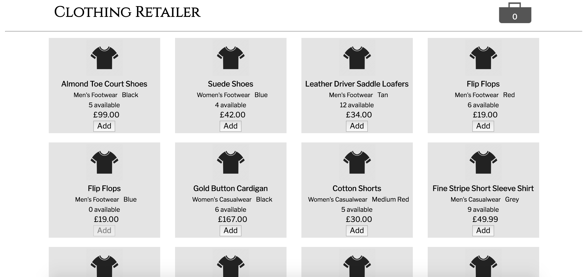

# Clothing Retailer



###The project brief

The retailer sells six different categories of clothes: women’s footwear, men’s
footwear, women’s casualwear, men’s casualwear, women’s formalwear and
men’s formalwear.
The page that you develop should display all of the available products, as well
as a shopping cart to which they can be added.

There are also discount vouchers available that can be redeemed. The
discount vouchers are as follows:
• £5.00 off your order
• £10.00 off when you spend over £50.00
• £15.00 off when you have bought at least one footwear item and spent
over £75.00

The prioritised list of user stories is as follows:
As a User I can view the products and their category, price and availability
information.
- [x] As a User I can add a product to my shopping cart.
- [x] As a User I can remove a product from my shopping cart.
- [x] As a User I can view the total price for the products in my shopping
cart.
- [x] As a User I can apply a voucher to my shopping cart.
- [x] As a User I can view the total price for the products in my shopping cart
with discounts applied.
- [x] As a User I am alerted when I apply an invalid voucher to my shopping
cart.
- [x] As a User I am unable to add Out of Stock products to the shopping cart.

### Installation

You need [node.js](http://nodejs.org) installed globally:

```sh
$ git clone git@github.com:maherz2/clothing-retailer.git
$ cd clothing-retailer
$ npm install
$ cd client
$ npm install
$ cd ..
$ npm start
```
visit [http://localhost:5000](http://localhost:5000)

### Using the website

- To add an item to the shopping basket click add below the item discription
- To view the basket toggle the basket icon in the top right corner
- Remove an item by clicking the x button
- Use the codes "5OFF", "10OFF" and "15OFF" as valid voucher codes to apply to your order

### Technologies Used

* [node.js](http://nodejs.org)
* [express](http://expressjs.com)
* [reactjs](https://facebook.github.io/react/)
* [lodash](https://github.com/lodash/lodash)

### Tests

```sh
$ cd client
$ npm test
```


### How I developed the solution

I initially started by planning the models I wanted to implement, writing the tests for them and getting them to pass by building the models. Once I did this I began building the react components and a skeleton layout.

I decided to use react to build my frontend as it is a technology I'm currently learning to use and this project really helped my understanding of it. Being new to the technology I found myself trying different approaches to the solution which meant my models changed during the course of development and my tests needed updating.

I enjoyed creating this website and gaining a deeper understanding of the technologies I used and I am very satisfied with the result.

### Improvements

- Put all logic into the models
- Save basket contents to local storage
- Add a 'checkout button' that updates stock levels on purchase and not when an item is added to the basket
- Within the shopping basket allow items to bundle quantities so that an order with 3 of the same item does not produce 3 entry lines in the basket
- improve css by adding transitions and colour
- refactored css
- Refactor tests
- Look into possibly using other frameworks

